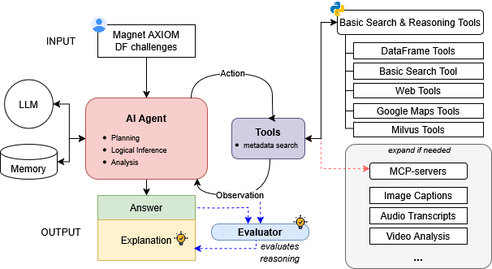

# ArtifactX



## Introduction
ArtifactX is an evaluation framework designed to test and verify the accuracy of different AI models in solving digital forensics challenges. It specifically focuses on assessing both evidence/artifact retrieval and correct inferential reasoning.

## Key Features
* **AI Agent System:** A robust AI agent equipped with planning, logical inference, analysis modules, an LLM, and a memory component.
* **Diverse Toolset:** Integration of specialized tools (Basic DataFrame, Basic Forensic, Basic Web, Google Maps, and Milvus Tools) enabling precise file system navigation, keyword/regex-based searching, and structured data processing for effective reasoning.
* **Standardized Dataset:** Utilization of a manually curated dataset of recent AXIOM digital forensic challenge questions and matching artifact reports for consistent and reliable evaluation.
* **Performance Evaluation:** An integrated Evaluation Agent that distinguishes between data retrieval and reasoning performance, providing in-depth analysis of factual accuracy and identifying specific shortcomings in the investigative process.
* **Developer Guidance:** Detailed evaluation feedback to guide prompt engineering, tool integration, and the optimization of smaller, task-specific language models.

## System Architecture (High-Level)
The core of ArtifactX is an AI Agent operating in an Action-Observation loop. This agent determines actions, executes them through a diverse set of specialized tools, and processes observations to refine its strategy. Data is structured for robust reasoning. An Evaluation Agent is integrated to assess performance, providing detailed insights. Human-in-the-Loop (HITL) support can be enabled for interactive use.

## Getting Started
ArtifactX currently employs a single agent architecture, with multi-agent expansion planned. Version 1.0 supports OpenAI or Anthropic models for retrieval and reasoning, with future support for open-source models.

Sample CSV files for Magnet AXIOM reports are provided. For full case analysis, extract Magnet AXIOM cases to CSVs and place them in the `axiom_data` directory. Adjust the `config.json` file to specify correct data paths. 

**WARNING:** The `case_name` in your configuration MUST exactly match the directory name located inside the `axiom_data` folder. For optimal operation, adhere to the following data structure:

```markdown
case_2025_windows/
├── Export/
│   ├── Attachments/
│   │   ├── 0.JPG
│   │   └── about.txt
│   └── nav_data/
│       └── case_2025_windows.json (nav.html converted to json)
├── AmCache Program Entries.csv
├── Edge Chromium Web Visits.csv
└── ...
```

Ground truth questions and answers for 2022 Windows, 2023 Windows Server, 2023 Windows PC, and 2025 Windows are located in the `ground_truth` directory.

For vector search (image and text for attachments), Milvus is used via Docker Compose.

To start Milvus:
```bash
sudo docker compose up -d
```
To check if Milvus is running:
```bash
sudo docker-compose ps
```
To stop or delete Milvus data:
```bash
sudo docker compose down
sudo rm -rf volumes
```

To integrate MCP servers as tools, add to the `mcp_servers.json` file:
```json
# config/mcp_servers.json
{
    "milvus": {
        "url": "http://localhost:8000/sse",
        "transport": "sse"
    }
}
```

## Running ArtifactX
Before execution, ensure your API key is added to the `.env` file. 

To run the system in evaluation mode:
```bash
python sing_agent.py --evaluate
```

To activate Human-in-the-Loop (HITL) features:
```bash
python sing_agent.py --interactive
```
**WARNING:** The system is primarily designed for automated tests and may not correctly interpret interruption messages in interactive mode.

## Performance
Our current performance on the Magnet AXIOM data is as follows:


| Dataset        | Evaluation Method          | ChatGPT | Cursor                   | ArtifactX |  ArtifactX |           
| :------------- | :------------------------- | :------ | :----------------------- | :-------- |:-------- |
|                | **Model**                  | **o3**  | **claude-3.7-sonnet-latest** | **gpt-4.1** | **o3** |
| 2022 Windows   | Retriever accuracy         | N/A     | 7/11                     | 6/11      | 00/11      | 
|                | # of Answers               | 6/11    | 6/11                     | 4/11      | 00/11      | 
| 2023 Windows   | Retriever accuracy         | N/A     | 7/13                     | 4/13       | 00/13      | 
|                | # of Answers               | 9/13    | 7/13                     | 5/13       | 00/13      | 
| 2023 Win Server| Retriever accuracy         | N/A     | 6/7                      | 3/7       | 00/7      | 
|                | # of Answers               | 6/7     | 5/7                      | 4/7       | 00/7      | 
| 2025 Windows   | Retriever accuracy         | N/A     | 11/16                    | 5/16      | 00/16      | 
|                | # of Answers               | 14/16   | 10/16                    | 8/16      | 00/16      | 

## How to Cite

```bibtex
@misc{ArtifactX2025,
  author    = {Choi, A., Park, H., Kim, K. Park, K, and Park, S.},
  title     = {ArtifactX: A Framework for Evaluating AI Agent Performance in Digital Forensics},
  howpublished = {\url{https://github.com/HMdeepcase/artifactx}},
  year      = {2025},
  note   = {GitHub repository}
}
```


